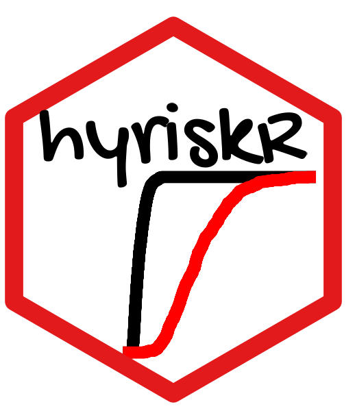

<p align="center">
  
</p>

Uncertainty analysis is an unavoidable risk assessment task (for instance for natural hazards, or for environmental issues). In situations where data are scarce, incomplete or imprecise, the systematic and only use of probabilities can be debatable. Several alternative mathematical representation methods have been developed to handle in a more flexible manner the lack of knowledge related to input parameters of risk assessment models. 

We present here an R package `hyriskR` for hybrid uncertainty quantification in environmental risk assessments. It is dedicated to jointly handling different mathematical representation tools, namely probabilities, possibility distributions and probability functions with imprecise parameters, for the different stages of uncertainty treatment in risk assessments (i.e,. uncertainty representation, propagation, sensitivity analysis and decision-making).

## Scientific documentation of the methods

-   [Guyonnet et al., 2003](https://doi.org/10.1061/(ASCE)0733-9372(2003)129:1(68))
-   [Baudrit et al., 2007](https://doi.org/10.1016/j.ijar.2006.07.001)
-   [Rohmer et al., 2018](https://eartharxiv.org/repository/view/1236/)
-   A full video tutorial is also available on the EGU platform [here](https://meetingorganizer.copernicus.org/EGU21/session/38918) (*you will need to have a Copernicus account*)

## Installation

This package can be installed directly by running:

``` r
devtools::install_github("anrhouses/hyriskR")
```

## Tutorials

Different tutorials are available:
* Use of probabilities and possibilities [R markdown available here](vignettes/possibility.Rmd)
* Use of p-boxes [R markdown available here](vignettes/pbox.Rmd)
* Step-by-step application to a real case for coastal dyke failure assessment [R markdown available here](vignettes/hyrisk_demo.Rmd)

## Applications of the package

This package has been used in several peer-reviewed publications:

> Le Cozannet, G., Manceau, J. C., & Rohmer, J. (2017). 
> Bounding sea level projections within the framework of the possibility theory
> Environ. Res. Lett. 12(1), 014012.

> Rohmer, J., Le Cozannet, G., & Manceau, J. C. (2019).
> Addressing ambiguity in probabilistic assessments of future coastal
> flooding using possibility distributions. Climatic Change, 155(1), 95-109.

> Horita K, Recking A, Piton G, Vazquez-Tarrio D, Pitlick J, Sprouse G. (2020).
> Uncertainty propagation analysis of bedload transport estimates with consideration of how to appropriately quantify the natural variability of flow and grain size parameters in gravel bed rivers.
> AGU Fall 2020. EP015-08 pp. 1 December [online] Available at: https://hal.science/hal-03006056 

> Thiéblemont, R., Le Cozannet, G., Rohmer, J., Toimil, A., Álvarez-Cuesta, M., & Losada, I. J. (2021).
> Deep uncertainties in shoreline change projections: an extra-probabilistic approach applied to sandy beaches.
> Natural Hazards and Earth System Sciences, 21(7), 2257-2276.

> Piton, G., Goodwin, S. R., Mark, E., & Strouth, A. (2022).
> Debris flows, boulders and constrictions: a simple framework for modeling jamming, and its consequences on outflow.
> Journal of Geophysical Research: Earth Surface, 127(5), e2021JF006447.

> Shirra H. (2024).
> Modeling Jamming Caused by Debris Flows Through a Series of Cascading Structures,
> Msc Thesis, Univ. Grenobles Alpes, Grenobe-INP, ENSE3: Grenoble, France [online] Available at: https://hal.inrae.fr/hal-04670924v1

> Belbèze, S., Rohmer, J., Guyonnet, D., Négrel, P., & Tarvainen, T. (2025).
> Improving spatial interpolation for anomaly analysis in presence of sparse, clustered or imprecise data sets.
> Journal of Geochemical Exploration, 107868.

## How to Cite

If you use hyriskR in your research, please cite it as follows:

```bibtex
@article{rohmer2018hyrisk,
  title={HYRISK: An R package for hybrid uncertainty analysis using probability, imprecise probability and    possibility distributions},
  author={Rohmer, Jeremy and Manceau, Jean-Charles and Guyonnet, Dominique and Boulahya, Faiza and Dubois, Didier},
  year={2018},
  publisher={EarthArXiv}
  doi={https://doi.org/10.31223/osf.io/j67cy}
}
```

## License

`hyriskR` is free software released under the GNU General Public License v3.0.

## Acknowledgements

New developments were supported by the French National Research Agency within the HOUSES project (ANR-22-CE56-
0006).

